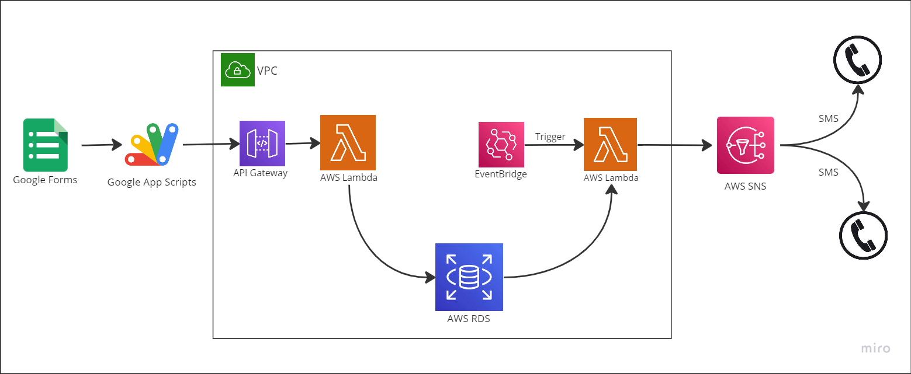

# Remind Me!

The Data Collection and Reminder System is a project that facilitates seamless data collection from users through a Google Form, processes the data using AWS Lambda functions, and securely stores it in AWS databases. It also includes a reminder service to keep subscribed individuals informed about upcoming events. This project leverages the robust infrastructure of AWS to ensure efficient data processing, storage, and delivery.

## Key Features

- **Google Form Integration**: Users can conveniently submit data through a user-friendly Google Form, simplifying the data collection process.
- **AWS Lambda for Data Processing**: AWS Lambda functions are used to process the collected data, allowing for customized transformations and validations.
- **AWS Database Storage**: The processed data is securely stored in AWS databases, ensuring data confidentiality and reliability.
- **Reminder Service**: Subscribed individuals receive timely reminders about upcoming events, leveraging the processed data for personalized notifications.
- **Robust Infrastructure**: The project utilizes AWS Lambda and AWS databases, benefiting from high performance, scalability, and resilience in data processing.

## Benefits

- **Efficient Data Collection and Processing**: The integration with Google Form and AWS Lambda enables streamlined data collection and customized data processing, ensuring accurate and reliable results.
- **Secure Data Storage**: AWS databases provide a secure and reliable storage solution, safeguarding the confidentiality and integrity of processed data.
- **Timely Event Reminders**: The reminder service utilizes the processed data to send timely notifications, keeping subscribed individuals informed and engaged.
- **Scalable Solution**: By leveraging AWS infrastructure, including Lambda functions, the project can handle increasing data volumes and user demands effectively, ensuring scalability as the project grows.

## Installation

To install and run the Data Collection and Reminder System locally, follow these steps:

1. Clone the project repository: `git clone https://github.com/your/repo.git`
2. Set up the necessary dependencies and environment.
3. Configure the integration with Google Form and AWS services.
4. Run the application locally for testing and development.

## Usage

1. Access the web interface to submit data through the Google Form.
2. The submitted data will be processed by AWS Lambda functions and securely stored in AWS databases.
3. Subscribed individuals will receive event reminders based on the processed data.
4. Monitor the application and perform regular maintenance tasks to ensure smooth operation.

